<!-- ✦ Handmade animated SVGs live in /assets — generated, not templated. ✦ -->

<a href="https://thirthpatel2-web.github.io"></a>

<p align="center">
  <a href="https://thirthpatel2-web.github.io"></a>
  <a href="https://www.linkedin.com/in/thirth-p-a23aa0339"></a>
  <a href="mailto:thirthpatel2@gmail.com"></a>
  
</p>

<p align="center">
  <a href="https://thirthpatel2-web.github.io"></a>
  <br/>
  <sub>projects · skills · contact — <a href="https://thirthpatel2-web.github.io">thirthpatel2-web.github.io</a></sub>
</p>

&nbsp;

## `> ls ~/projects --best`

<p align="center">
  <a href="https://github.com/thirthpatel2-web/Civiclens"></a>
  <a href="https://github.com/thirthpatel2-web/cascade-failure-env"></a>
  <a href="https://github.com/thirthpatel2-web/disaster-intel"></a>
  <a href="https://github.com/thirthpatel2-web/Road_scan_AI-"></a>
  <a href="https://github.com/thirthpatel2-web/AI-Resume_Analyser"></a>
  <a href="https://github.com/thirthpatel2-web/EthicaMind"></a>
</p>

<details>
<summary><code>> ls ~/projects --all</code></summary>
<br/>

| | Project | What it is |
|:-:|---|---|
| 🎯 | [SkillSense](https://github.com/thirthpatel2-web/Skillsense) | Résumé → predicted career track (TF-IDF + logistic regression) + skills to learn next |
| 🛡️ | [DisasterShield AI](https://github.com/thirthpatel2-web/disastershield-ai) | React disaster-response console: simulation, SOS alerts and a Groq analyst |
| 💼 | [JobConnect](https://github.com/thirthpatel2-web/job-listing-portal) | Job portal with seeker/employer roles, JWT auth and application tracking |
| 🎓 | [Student CRUD Dashboard](https://github.com/thirthpatel2-web/student-crud-dashboard) | Express + MongoDB REST API with a lightweight dashboard |

</details>

&nbsp;

## `> cat ~/.toolbox`

<p align="center">
  
  <br/>
  
  <br/>
  
</p>

<p align="center">
  
  
  
  
</p>

&nbsp;

## `> ./stats --live`



<p align="center">
<picture>
  <source media="(prefers-color-scheme: dark)" srcset="https://raw.githubusercontent.com/thirthpatel2-web/thirthpatel2-web/output/snake-dark.svg"/>
  <source media="(prefers-color-scheme: light)" srcset="https://raw.githubusercontent.com/thirthpatel2-web/thirthpatel2-web/output/snake.svg"/>
  
</picture>
</p>

&nbsp;

## `> echo $NOW`

```diff
+ going deeper into AI & Robotics — agents, computer vision, LLM systems
+ turning messy real-world problems into software that actually ships
+ always up for building something useful together
```

<a href="https://thirthpatel2-web.github.io"></a>
